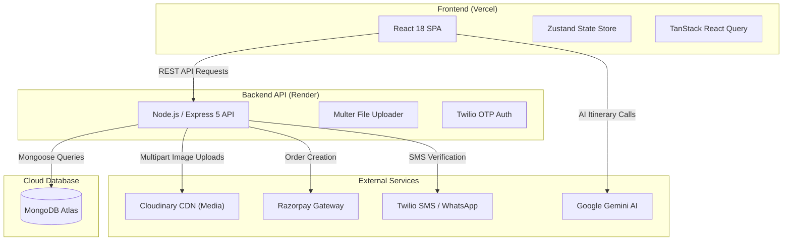

# Questora — Escape Beyond


> **A next-generation MERN-stack weekend-first travel ecosystem connecting travelers directly with authentic homestays, verified local guides, self-drive rentals, and AI-powered trip planning.**

---

## 🎬 Demo / Screenshots / Video

| Landing Page & Hero Showcase | AI Trip Planner & Itinerary | Homestays & Verified Guides |
| :---: | :---: | :---: |
| *Modern Dark Glassmorphic UI* | *Custom AI-Generated Itineraries* | *Direct WhatsApp Connect & Onboarding* |

*Explore the live demo or deploy your own instance following the [Installation](#14-installation) guide below.*

---

## 6. Overview

**Questora** transforms traditional travel booking by delivering a seamless, weekend-focused marketplace designed for spontaneous getaway planning. Built to eliminate heavy intermediate commission fees charged by conventional Online Travel Agencies (OTAs), Questora directly connects travelers with local community homestays, certified city guides, and self-drive vehicles. Featuring an AI-powered itinerary engine, real-time destination crowd indicators, and automated WhatsApp trip assistance, Questora provides an effortless end-to-end travel experience.

---

## 7. Problem Statement

1. **High Commission Fees**: Traditional booking portals charge 15–20% commission from hosts and guides, driving up prices for travelers and reducing local host earnings.
2. **Platform Fragmentation**: Travelers currently switch between multiple websites to separately book stays, hire guides, rent vehicles, and research travel itineraries.
3. **Lack of Local Authenticity**: Mass-market booking engines prioritize large commercial hotel chains over authentic community homestays and certified local culture guides.
4. **Spontaneous Planning Friction**: Planning short 2-to-3 day weekend trips often involves tedious research and guesswork regarding destination crowdedness and budgets.

---

## 8. Solution

Questora addresses these challenges through a unified, high-performance web platform:
- **Zero-Commission WhatsApp Connect**: Enables direct 1-on-1 contact between travelers and local hosts/guides via WhatsApp.
- **All-in-One Travel Ecosystem**: Integrates Stays, Certified Guides, Self-Drive Vehicle Rentals, and AI Itinerary Generation into a single seamless SPA.
- **AI-Powered Trip Assistant**: Leverages Generative AI to instantly construct customized day-by-day itineraries based on dates, group size, and budget.
- **Real-Time Crowd & Demand Predictor**: Visual indicators (*Quiet*, *Moderate*, *Peak*) help travelers avoid overcrowded destinations.

---

## 9. Key Features

### 🏡 1. Homestays & Local Guides Marketplace (`/hosts-and-guides`)
- **Community Host Marketplace**: Explore handpicked local homestays with nightly pricing, guest capacity, bedroom count, and amenities (*WiFi, AC, Kitchen, Parking*).
- **Verified Local Guides**: Discover certified local guides categorized by expertise (*Heritage, Trekking, Culinary Walks, Photography, Local Living*), languages, experience, and rates.
- **Dual Partner Onboarding Form**: Interactive onboarding modal enabling hosts to list properties and local guides to register with GPS location auto-detection.

### 🧠 2. AI Trip Planner & Dynamic Itinerary Engine (`/plan`, `/itinerary/:destination`)
- **Personalized Itineraries**: Custom day-by-day travel plans tailored to travel dates, budget preference, travel style, and group size.
- **Real-Time Crowd Predictor**: Visual crowd level estimates informing travelers about expected popularity and busyness.
- **Interactive Budget Breakdown**: Detailed breakdowns of daily activities, recommended stays, culinary highlights, and total estimated expenses.

### 🚗 3. Self-Drive Vehicle Rentals (`/rentals`)
- **Diverse Mobility Fleet**: Browse self-drive SUVs, sedans, motorcycles, and scooters for weekend road trips.
- **Custom Filters**: Filter vehicles by city, transmission (Manual/Automatic), fuel type, and price range.

### 💬 4. Direct Zero-Commission Communication
- **WhatsApp Direct Connect**: Instant "Contact Host / Guide" action buttons linking travelers directly to host WhatsApp numbers without platform cuts.

### 🔐 5. Secure Payments & Authentication (`/booking`, `/login`)
- **Razorpay Integration**: Seamless payment order creation for confirmed reservations.
- **Twilio Phone OTP Authentication**: SMS verification with fallback development mode.

---

## 10. System Architecture



---

## 11. How It Works

1. **Explore & Plan**: Travelers visit Questora, select dates, budget, and destination, and generate an AI-customized itinerary.
2. **Browse Stays & Guides**: Filter verified homestays, certified local guides, or self-drive rentals matching trip preferences.
3. **Direct Contact or Book**: Connect directly with hosts via WhatsApp for zero-commission inquiries or complete online payment via Razorpay.
4. **Partner Onboarding**: Local hosts and guides complete a 3-minute modal form with GPS auto-location to publish listings globally.

---

## 12. Tech Stack

| Layer | Technology | Purpose & Function |
| :--- | :--- | :--- |
| **Frontend Framework** | **React 18** | Declarative component-based UI architecture |
| **Styling & Design System** | **Tailwind CSS & Glassmorphism** | Modern luxury dark UI, responsive grid system, micro-animations |
| **State Management** | **Zustand** | Global store for trip parameters, cart items, and user sessions |
| **Data Fetching** | **TanStack React Query (v5)** | Asynchronous API fetching, background refetching, and state caching |
| **Routing** | **React Router DOM (v6)** | Client-side routing with SPA rewrite rules |
| **Backend Runtime** | **Node.js (v24+) & Express 5** | RESTful routing, multipart processing, payment order endpoints |
| **Database** | **MongoDB & Mongoose 9** | NoSQL document storage for listings, users, and bookings |
| **Media Pipeline** | **Cloudinary CDN** | Automatic image upload, optimization, and global CDN delivery |
| **Integrations** | **Razorpay, Twilio, Gemini AI** | Secure payment processing, SMS OTP, and AI itinerary generation |

---

## 13. Project Structure

```text
Questora/
├── backend/                        ← Node.js & Express API Backend
│   ├── config/                     ← Cloudinary & External Configurations
│   │   └── cloudinary.js           
│   ├── models/                     ← Mongoose Schemas & Database Models
│   │   ├── Booking.js              ← Booking Schema
│   │   ├── Listing.js              ← Unified Listings (Stays & Guides)
│   │   └── User.js                 ← User Profiles & OTP State
│   ├── routes/                     ← Express REST API Endpoints
│   │   ├── authRoutes.js           ← Phone & OTP Verification Routes
│   │   └── listingRoutes.js        ← Listings CRUD & Upload Routes
│   ├── .env.example                ← Environment Variable Template
│   ├── package.json                ← Backend Dependencies
│   ├── server.js                   ← Express Server Entry Point
│   └── vercel.json                 ← Serverless Configuration
│
├── frontend/                       ← React Single Page Application
│   ├── public/                     ← Static Web Assets
│   ├── src/                        ← React Source Code
│   │   ├── components/             ← Reusable UI Components
│   │   │   ├── CarouselHero.jsx    ← Interactive Hero Carousel
│   │   │   ├── ListingModal.jsx    ← Property Onboarding Form
│   │   │   ├── Navbar.jsx          ← Glassmorphic Floating Header
│   │   │   └── WhatsAppAI.jsx      ← WhatsApp AI Assistant Trigger
│   │   ├── pages/                  ← Application Views
│   │   │   ├── BookingPage.jsx     ← Checkout & Confirmation Page
│   │   │   ├── HostsAndGuidesPage.jsx ← Homestays & Guides Catalogue
│   │   │   ├── ItineraryPage.jsx   ← AI Itinerary Showcase Page
│   │   │   ├── LandingPage.jsx     ← Hero Showcase & Destination Grid
│   │   │   ├── LoginPage.jsx       ← Phone OTP Login Page
│   │   │   ├── PlanPage.jsx        ← AI Trip Planner Form
│   │   │   └── RentalsPage.jsx     ← Self-Drive Vehicles Marketplace
│   │   ├── store/                  ← Zustand Global Store (`tripStore.js`)
│   │   ├── App.js                  ← App Router & Layout Shell
│   │   ├── config.js               ← Dynamic API Base URL Configuration
│   │   └── index.js                ← React Root Mount Point
│   ├── package.json                ← Frontend Dependencies
│   └── vercel.json                 ← Vercel SPA Rewrite Rules
│
├── whatsapp-assistant/             ← Autonomous WhatsApp AI Assistant Service
│   ├── controllers/                ← Webhook & Travel Bot Handlers
│   ├── models/                     ← Assistant Database Schemas
│   ├── routes/                     ← Webhook Routes
│   ├── services/                   ← AI & Distance Matrix Services
│   └── server.js                   ← Autonomous Bot Server
│
├── package.json                    ← Root Orchestration Scripts
└── README.md                       ← Comprehensive Project Documentation
```

---

## 14. Installation

### Prerequisites
- **Node.js**: v18.0.0 or higher
- **npm**: v9.0.0 or higher
- **MongoDB**: MongoDB Atlas Cluster URL or local MongoDB instance

### Step 1: Clone Repository
```bash
git clone https://github.com/Shlok-29/Questora.git
cd Questora
```

### Step 2: Install Dependencies
Install root, backend, and frontend dependencies:
```bash
# Install root monorepo tools
npm install

# Install backend dependencies
cd backend
npm install
cd ..

# Install frontend dependencies
cd frontend
npm install
cd ..
```

---

## 15. Usage

### Running Locally (Development Mode)
Run both backend and frontend concurrently from the root directory:
```bash
npm run dev
```

Or run services individually:
```bash
# Start backend server only (Port 5000)
npm run backend

# Start frontend application only (Port 3000)
npm run frontend
```

Open your browser and navigate to `http://localhost:3000`.

---

## 16. Configuration / Environment Variables

### Backend (`backend/.env`)
```env
PORT=5000
MONGO_URI=mongodb+srv://<username>:<password>@cluster0.mongodb.net/weekendwander?retryWrites=true&w=majority
CLOUDINARY_CLOUD_NAME=your_cloud_name
CLOUDINARY_API_KEY=your_api_key
CLOUDINARY_API_SECRET=your_api_secret
RAZORPAY_KEY_ID=your_razorpay_key_id
RAZORPAY_SECRET=your_razorpay_secret
TWILIO_ACCOUNT_SID=your_twilio_sid
TWILIO_AUTH_TOKEN=your_twilio_token
TWILIO_PHONE_NUMBER=your_twilio_phone
```

### Frontend (`frontend/.env`)
```env
REACT_APP_API_URL=http://localhost:5000/api
REACT_APP_GEMINI_API_KEY=your_gemini_api_key
REACT_APP_GOOGLE_MAPS_KEY=your_google_maps_key
REACT_APP_RAZORPAY_KEY_ID=your_razorpay_key_id
```

---

## 17. Workflow

```text
[ Traveler Landing ]
         │
         ├──► Browse Homestays & Certified Guides (/hosts-and-guides)
         │          │
         │          └──► Direct WhatsApp Connect (Zero Commission)
         │
         ├──► Plan Trip with AI Engine (/plan)
         │          │
         │          └──► View Customized Itinerary & Demand Index (/itinerary)
         │
         └──► Reserve Rentals / Homestays (/rentals, /booking)
                    │
                    └──► Secure Razorpay Checkout
```

---

## 19. Results / Performance

- **Production Bundle**: Optimized React 18 production bundle compressed to ~217 kB gzip main bundle size.
- **Client Caching**: TanStack React Query eliminates redundant API refetches across client navigation.
- **CDN Media Delivery**: Cloudinary image transformation pipeline delivers webp/avif optimized assets for instant page load times.

---

## 20. Future Roadmap

- [ ] **Regional Language Support**: Support for Hindi, Kannada, Tamil, and Marathi localizations.
- [ ] **Offline Travel Mode**: PWA support for offline access to booked itineraries and guide contact cards.
- [ ] **Group Itinerary Collaboration**: Real-time multi-user itinerary editing via WebSockets.
- [ ] **Blockchain Credentials**: Decentralized verification badges for local city guides.

---

## 21. Limitations

- **SMS Verification**: Twilio SMS OTP requires active account SID credentials for SMS delivery; falls back to dev log mode when unconfigured.
- **AI Rate Limits**: Google Gemini API itinerary generation relies on standard free/paid tier quotas.

---

## 22. Contributing

Contributions are welcome! Please follow these steps:
1. Fork the repository.
2. Create your feature branch (`git checkout -b feature/AmazingFeature`).
3. Commit your changes (`git commit -m 'Add some AmazingFeature'`).
4. Push to the branch (`git push origin feature/AmazingFeature`).
5. Open a Pull Request.

---

## 24. Author

**Shlok Dubey**  
- GitHub: [@Shlok-29](https://github.com/Shlok-29)  
- Project Workspace: `Questora`

---

## 25. Acknowledgements

- [React.js](https://reactjs.org/) & [Tailwind CSS](https://tailwindcss.com/)
- [Express.js](https://expressjs.com/) & [MongoDB Atlas](https://www.mongodb.com/atlas)
- [Cloudinary CDN](https://cloudinary.com/)
- [Razorpay Payments](https://razorpay.com/)
- [Twilio Communications](https://www.twilio.com/)
- [Google Gemini AI](https://ai.google.dev/)
- [Lucide Icons](https://lucide.dev/) & [Framer Motion](https://www.framer.com/motion/)
